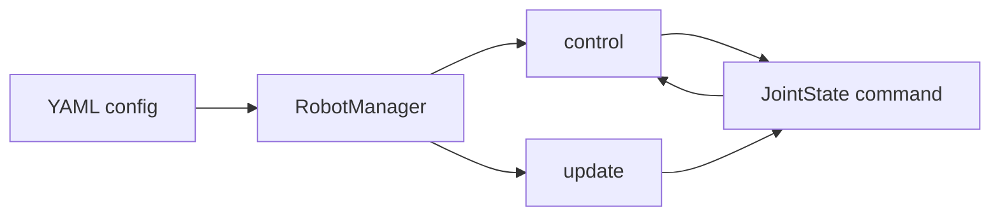

# Robot Manager

Load robot from **YAML**, run a **control loop** (control / update), plan paths with **RRT**.

**Run:** `RobotManager(config_path)` → loop `control(status)` / `update(status, obstacles)`.  
**Install:** `pip install -e .`  
**Tests:** `pytest tests/ -v`  
**GUI:** `python tests/test_gui.py` (needs `config/robot_config.yaml`).

Config keys under `robot`: `id`, `number_of_joints`, `scheduler_type`, `planner_type`, `type` (e.g. `little_reader`). Optional: `controller_indexes`.
