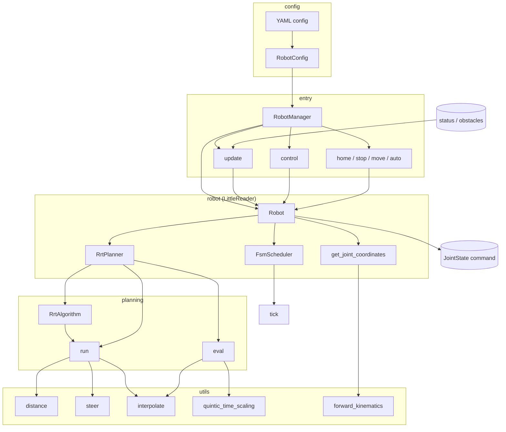

# Robot Manager

Load a robot from **YAML config**, run a **control loop** (control / update), and plan paths with **RRT** in arbitrary configuration spaces.

---

## Overview

- **Purpose:** Single entry point to create a robot from a config file, then run a periodic control loop and optional path planning.
- **Flow:** Load YAML → build `RobotManager` and robot instance → call `control(status)` and `update(status, obstacles)` in a loop. Commands come from `control`; state and obstacles are fed via `update`.

---

## Main entry: RobotManager

- **Class:** `RobotManager`
- **Role:** Loads robot config from YAML, creates the robot (e.g. LittleReader), and exposes control/update and mode methods.
- **Constructor:** `RobotManager(config_file: str)` — reads YAML, validates `robot` section, builds `RobotConfig`, instantiates the robot, and calls `initialize()`.
- **Control:** `control(status: JointState) -> JointState | None` — returns the next joint command, or `None` if none.
- **Update:** `update(status, obstacles=None)` — pushes current joint state and optional obstacle list into the robot.
- **Modes:** `home()`, `stop()`, `move()`, `auto()` — set internal flags on the robot (homing, moving, stopped, auto).

---

## Config (YAML)

Required keys under `robot`:

- **id** — Robot identifier.
- **number_of_joints** — Number of joints.
- **scheduler_type** — e.g. `fsm`.
- **planner_type** — e.g. `rrt`.
- **type** — Robot model, e.g. `little_reader`.

Optional:

- **controller_indexes** — List of controller indices.

Example: see `config/robot_config.yaml`.

---

## How to run

- **Install:** `pip install -e .`
- **Use:** `RobotManager("config/robot_config.yaml")` then loop `control(status)` / `update(status, obstacles)`.
- **Tests:** `python3 -m pytest tests/ -v`
- **GUI:** `python tests/test_gui.py` (requires `config/robot_config.yaml`).
