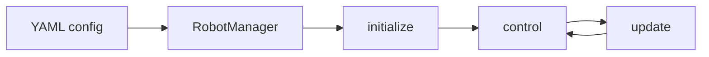

# Robot Manager

Library for loading a robot from **YAML config**, running a **control loop** (control / update), and planning paths with **RRT** in arbitrary configuration spaces.

---

## At a glance



| Topic | Description |
|-------|-------------|
| **Install** | `pip install -e .` |
| **Run** | `RobotManager(config_path)` → `initialize()` → loop: `control()` / `update(status, obstacle)` |
| **Tests** | `python3 -m pytest tests/ -v` |
| **GUI** | `python tests/test_gui.py` (config: `config/robot_config.yaml`) |

---

## Quick start

```bash
pip install -e .
```

```python
from robot_manager import RobotManager

manager = RobotManager("config/robot_config.yaml")
manager.initialize()

# Control loop: get command → feed back status/obstacle
cmd = manager.control(status=current_joint_state)
manager.update(status=current_joint_state, obstacle=obstacle_state)
```

---

## Config (YAML)

Add the following keys under the `robot` section.

| Key | Required | Description |
|-----|:--------:|-------------|
| `id` | ✓ | Robot ID |
| `number_of_joints` | ✓ | Number of joints |
| `scheduler_type` | ✓ | Scheduler type (e.g. `fsm`) |
| `planner_type` | ✓ | Planner type (e.g. `rrt`) |
| `type` | ✓ | Robot model (e.g. `little_reader`) |
| `controller_indexes` |  | (Optional) Controller index list |

**Example** (`config/robot_config.yaml`):

```yaml
robot:
  id: 1
  number_of_joints: 3
  scheduler_type: fsm
  planner_type: rrt
  type: little_reader
  controller_indexes: []
```

---

## Tests

| File | Description |
|------|-------------|
| `test_scheduler.py` | FSM scheduler state transitions, tick, HOME → STOPPED |
| `test_planner.py` | RRT algorithm and planner; **per–config-space visualizations** (output: `tests/visualizations/*.png`) |
| `test_gui.py` | Config existence, RobotManager init; same file runs GUI: `python tests/test_gui.py` |

```bash
python3 -m pytest tests/ -v
```

---

## GUI

Run with `python tests/test_gui.py`. Requires `config/robot_config.yaml`.

| Button | Action |
|--------|--------|
| **Home** | Home motion |
| **Move** | Move |
| **Stop** | Stop |
| **Auto** | Auto mode |

`control()` / `update()` are called periodically via timers.

---

## RRT planner

Path planning in **any** Euclidean configuration space (joint position, pose position, velocity, etc.).

| Space example | Description |
|---------------|-------------|
| `joint_state.position` | Joint space |
| `pose.position` | End-effector position (x, y, z) |
| `velocity.linear` | Linear velocity, etc. |

**Usage flow**

1. `RrtPlanner.generate_trajectory(start_config, goal_config, obstacle_state)` to build a trajectory.  
2. `eval_config(progress)` — generic config space.  
3. `eval(progress, joint_command)` — for joint space.

Obstacles are passed as state in the same configuration space.
