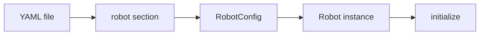

# config

Robot configuration is loaded from **YAML**. `RobotManager(config_file)` reads the file and expects a top-level `robot` section.



---

## Overview

- **Purpose:** Define which robot model to use and which scheduler/planner types to instantiate. Loaded once at `RobotManager(config_file)`.
- **File:** Typically `config/robot_config.yaml` (path is passed by the application or GUI).
- **Structure:** Single top-level key `robot` with a dictionary of keys below.

---

## Required keys (under `robot`)

- **id** — Robot identifier (integer). Passed to `RobotConfig.id`.
- **number_of_joints** — Number of joints (integer). Used to size joint state arrays.
- **scheduler_type** — String. Which scheduler to create; e.g. `fsm` for `FsmScheduler`.
- **planner_type** — String. Which planner to create; e.g. `rrt` for `RrtPlanner`.
- **type** — String. Robot model type; e.g. `little_reader` to instantiate `LittleReader`. Must match a known robot type or loading raises.

---

## Optional keys

- **controller_indexes** — List of integers. Controller indices for the robot. If omitted, defaults to an empty list.

---

## Example

See `robot_config.yaml` in this folder:

```yaml
robot:
  id: 1
  number_of_joints: 4
  scheduler_type: fsm
  planner_type: rrt
  type: little_reader
  controller_indexes: []
```

---

## Usage

- **RobotManager:** `RobotManager("config/robot_config.yaml")` — constructor loads this file, validates required keys, builds `RobotConfig`, creates the robot, and calls `initialize()`.
- **GUI:** `python tests/test_gui.py` uses `config/robot_config.yaml` by default; the config path is set in the test module.
- **Validation:** Missing any required key raises `ValueError` with a message indicating which key is missing. Unknown `type` also raises.
