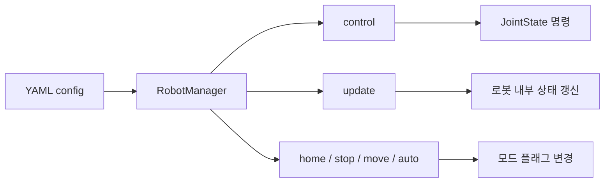
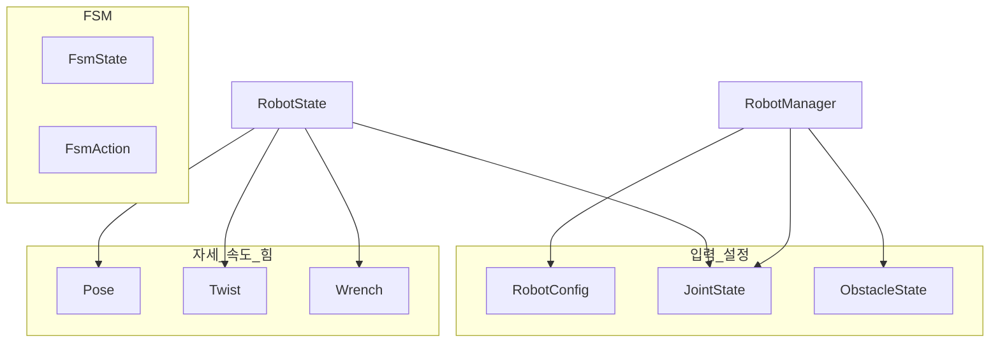

# robot_manager

YAML 설정으로 로봇을 불러와 제어·갱신·홈/정지/이동/자동 모드를 제공하는 상위 API입니다.

---

## 구조 개요

```
┌─────────────────────────────────────────────────────────────┐
│  RobotManager (robot_manager.py)                             │
│  ┌─────────────┐  ┌─────────────┐  ┌─────────────────────┐  │
│  │ config 로드  │→│ robot 생성   │→│ control / update /   │  │
│  │ (YAML)      │  │ (LittleReader)│  │ home·stop·move·auto │  │
│  └─────────────┘  └─────────────┘  └─────────────────────┘  │
└─────────────────────────────────────────────────────────────┘
         │                    │
         ▼                    ▼
┌─────────────────┐  ┌─────────────────────────────────────────┐
│  types.py       │  │  로봇 상태/입력용 데이터 (dataclass)      │
│  JointState     │  │  ObstacleState, Pose, Twist, Wrench,     │
│  RobotConfig    │  │  RobotState, FsmState, FsmAction         │
└─────────────────┘  └─────────────────────────────────────────┘
```

---

## RobotManager (robot_manager.py)

**역할**  
설정 파일 경로 하나로 로봇을 초기화하고, 제어 명령·상태 갱신·모드 전환을 담당합니다.

### 생성 및 초기화

- **`__init__(config_file)`**  
  - YAML 파일 경로를 받아 로봇 설정을 읽고, 해당 타입(예: LittleReader) 인스턴스를 만들고 초기화합니다.  
  - 설정에 반드시 필요한 키: `id`, `number_of_joints`, `scheduler_type`, `planner_type` (그리고 `type` 또는 기본 `little_reader`).

### 제어·갱신

- **`control(status)`**  
  - 현재 관절 상태 `JointState`를 넣으면, 다음 제어 명령 `JointState | None`을 반환합니다.  
  - 명령이 없으면 `None`을 반환합니다.

- **`update(status, obstacle=None)`**  
  - 현재 관절 피드백 `status`로 로봇 내부 상태를 갱신합니다.  
  - 선택적으로 `ObstacleState`를 넘기면 장애물 정보를 반영해 플래닝/충돌 회피에 사용할 수 있습니다.

### 모드 전환

- **`home()`**  
  - 홈 동작을 시작합니다. (homing 플래그 켜고, move/operating 끔.)

- **`stop()`**  
  - 모든 동작을 멈춥니다. (homing, moving, operating 모두 끔.)

- **`move()`**  
  - 이동 모드로 전환합니다. (moving 켜고, homing/operating 끔.)

- **`auto()`**  
  - 자동 운전(operating) 모드로 전환합니다. (operating 켜고, homing/moving 끔.)

---

## 제어 흐름 (개념)



- **설정** → `RobotManager(config_file)` 로 한 번 로드·초기화.  
- **주기 루프** → `update(status, obstacle?)` 로 상태 갱신, `control(status)` 로 다음 관절 명령 수신.  
- **사용자/시퀀스** → `home()`, `stop()`, `move()`, `auto()` 로 모드만 전환.

---

## 타입 (types.py)

모든 항목은 **dataclass**이며, 로봇/스케줄러/플래너 간에 주고받는 데이터를 정의합니다.

### 제어·피드백

- **JointState** — 관절 공간: `id`, `position`, `velocity`, `torque` (각각 1차원 배열).
- **ObstacleState** — 장애물: `position`(중심), `radius`, `zaxis` (구/원 표현).
- **RobotConfig** — 로봇 설정: `id`, `number_of_joints`, `controller_indexes`, `scheduler_type`, `planner_type`, `robot_type` (문자열).

### 자세·속도·힘

- **Pose** — 위치 `position` (3,) + 자세 `orientation`.
- **Twist** — 선속도 `linear` + 각속도 `angular` (각 3차원).
- **Wrench** — 힘 `force` + 토크 `torque` (각 3차원).

### 로봇 전체 상태

- **RobotState** — 한 번에: `id`, `number_of_joints`, `pose`, `twist`, `wrench`, `joint_state`.

### FSM(스케줄러)

- **FsmState** — 상태 스냅샷: `state`(id), `progress`(0~1).
- **FsmAction** — 액션: `action`(id), `duration`(예: 초 단위).

---

## 타입 관계 (요약)



- **RobotManager**는 `RobotConfig`로 생성되고, `JointState`/`ObstacleState`를 받아 `control`/`update`에 사용합니다.  
- **RobotState**는 Pose·Twist·Wrench·JointState를 묶은 전체 상태입니다.
