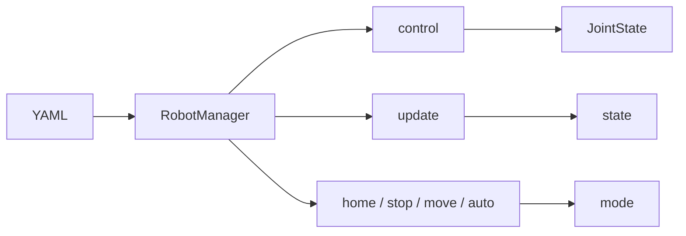

# robot_manager

High-level package: load robot from **YAML**, expose **control**, **update**, and **home / stop / move / auto** modes.

---

## Overview

- **Purpose:** Provide a single API to create a robot from config and drive it via control, update, and mode switches.
- **Main module:** `robot_manager.py` — defines `RobotManager`. Types live in `types.py` (and may be re-exported from package `__init__.py`).

---

## Class: RobotManager

- **Module:** `robot_manager.py`
- **Role:** Build robot from YAML and forward control/update/mode calls to the robot instance.
- **Constructor:** `__init__(config_file: str)` — loads YAML, builds `RobotConfig`, creates robot (e.g. LittleReader), calls `robot.initialize()`.
- **control(status: JointState) -> JointState | None** — Returns next joint command; `None` when no command is available.
- **update(status, obstacles=None)** — Updates robot internal state with current joint feedback and optional obstacle list.
- **home()** — Sets homing flag, clears move/auto.
- **stop()** — Clears homing/moving/auto (stop motion).
- **move()** — Sets moving flag, clears homing/auto.
- **auto()** — Sets auto flag, clears homing/moving.

---

## Types (types.py)

Used across robot, scheduler, and planner.

**Control and state**

- **JointState** — `id`, `position`, `velocity`, `torque` (arrays).
- **RobotConfig** — `id`, `number_of_joints`, `controller_indexes`, `scheduler_type`, `planner_type`, `robot_type`.

**Obstacles**

- **SphereObstacleState** — `id`, `position`, `radius`.
- **CircleObstacleState** — `id`, `position`, `radius`, `axis` (plane normal).
- **SelfObstacleState** — `id`, `position`, `radius`, `neighbor_id` (for self-collision).

**FSM (scheduler)**

- **FsmState** — `state` (id), `progress` (0–1).
- **FsmAction** — `action` (id), `duration`.

**Pose / twist / wrench**

- **Pose** — `position`, `orientation`.
- **Twist** — `linear`, `angular` (velocities).
- **Wrench** — `force`, `torque`.
- **RobotState** — Aggregates `pose`, `twist`, `wrench`, `joint_state`.
