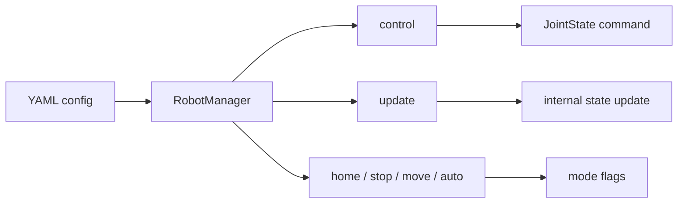

# robot_manager

High-level API that loads a robot from YAML config and provides control, state updates, and home/stop/move/auto modes.

---

## Overview

```
┌──────────────────────────────────────────────────────────────────┐
│  RobotManager (robot_manager.py)                                 │
│  ┌──────────────┐   ┌────────────────┐   ┌─────────────────────┐ │
│  │ load config  │ → │ create robot   │ → │ control / update /  │ │
│  │ (YAML)       │   │ (LittleReader) │   │ home·stop·move·auto │ │
│  └──────────────┘   └────────────────┘   └─────────────────────┘ │
└──────────────────────────────────────────────────────────────────┘
         │                    │
         ▼                    ▼
┌─────────────────┐  ┌─────────────────────────────────────────┐
│  types.py       │  │  Dataclasses for state and I/O          │
│  JointState     │  │  ObstacleState, Pose, Twist, Wrench,    │
│  RobotConfig    │  │  RobotState, FsmState, FsmAction        │
└─────────────────┘  └─────────────────────────────────────────┘
```

---

## RobotManager (robot_manager.py)

**Role**  
Initializes the robot from a single config file path and handles control commands, state updates, and mode changes.

### Construction and initialization

- **`__init__(config_file)`**  
  - Reads robot config from the given YAML path, builds the configured robot instance (e.g. LittleReader), and initializes it.  
  - Required config keys: `id`, `number_of_joints`, `scheduler_type`, `planner_type` (and `type`, or default `little_reader`).

### Control and update

- **`control(status)`**  
  - Takes current joint state `JointState` and returns the next control command `JointState | None`.  
  - Returns `None` when no command is available.

- **`update(status, obstacle=None)`**  
  - Updates the robot’s internal state with current joint feedback `status`.  
  - Optionally pass `ObstacleState` to feed obstacle data for planning/collision avoidance.

### Mode switching

- **`home()`**  
  - Starts homing (sets homing flag, clears move/operating).

- **`stop()`**  
  - Stops all motion (clears homing, moving, operating).

- **`move()`**  
  - Switches to move mode (sets moving, clears homing/operating).

- **`auto()`**  
  - Switches to auto/operating mode (sets operating, clears homing/moving).

---

## Control flow (concept)



- **Setup** → Load and initialize once with `RobotManager(config_file)`.  
- **Control loop** → Call `update(status, obstacle?)` to refresh state and `control(status)` to get the next joint command.  
- **User/sequence** → Use `home()`, `stop()`, `move()`, `auto()` to change mode only.

---

## Types (types.py)

All of the following are **dataclasses** used to pass data between robot, scheduler, and planner.

### Control and feedback

- **JointState** — Joint space: `id`, `position`, `velocity`, `torque` (each a 1D array).
- **ObstacleState** — Obstacle: `position` (center), `radius`, `zaxis` (sphere/circle).
- **RobotConfig** — Robot config: `id`, `number_of_joints`, `controller_indexes`, `scheduler_type`, `planner_type`, `robot_type` (strings).

### Pose, velocity, and wrench

- **Pose** — Position `position` (3,) and orientation `orientation`.
- **Twist** — Linear velocity `linear` and angular velocity `angular` (each 3D).
- **Wrench** — Force `force` and torque `torque` (each 3D).

### Full robot state

- **RobotState** — All in one: `id`, `number_of_joints`, `pose`, `twist`, `wrench`, `joint_state`.

### FSM (scheduler)

- **FsmState** — State snapshot: `state` (id), `progress` (0–1).
- **FsmAction** — Action: `action` (id), `duration` (e.g. seconds).

---

## Type relationships (summary)

```mermaid
flowchart TB
  subgraph 
    RobotConfig
    JointState
    ObstacleState
  end
  subgraph 
    Pose
    Twist
    Wrench
  end
  subgraph FSM
    FsmState
    FsmAction
  end
  RobotState --> Pose
  RobotState --> Twist
  RobotState --> Wrench
  RobotState --> JointState
  RobotManager --> RobotConfig
  RobotManager --> JointState
  RobotManager --> ObstacleState
```

- **RobotManager** is created with `RobotConfig` and consumes `JointState` / `ObstacleState` in `control` and `update`.  
- **RobotState** bundles Pose, Twist, Wrench, and JointState into a single full state.
