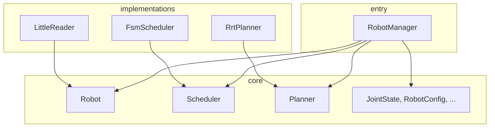

# robot_manager package

Robot control and scheduling library: YAML config loading, robot instance, control loop (control/update), and RRT planner.

---

## At a glance

| Module / package | Role | Main API |
|------------------|------|----------|
| **robot_manager** | Entry point: config load, robot ownership | `RobotManager`, `initialize()`, `control()`, `update()` |
| **core** | Shared types and abstract interfaces | `Robot`, `RobotConfig`, `JointState`, `Scheduler`, `Planner`, type converters |
| **scheduler** | Timing and state (FSM) | `FsmScheduler`, `State` / `Action`, transition table |
| **planner** | Path planning (background thread) | `RrtPlanner`, `plan()`, `eval()`, `generate_trajectory()` |
| **robots** | Concrete robot models | `LittleReader` (Robot subclass) |
| **utils** | RRT, geometry, kinematics helpers | `RrtAlgorithm`, `quintic_time_scaling`, `transformation_matrix`, `FKinSpace` |

---

## Dependencies (summary)

