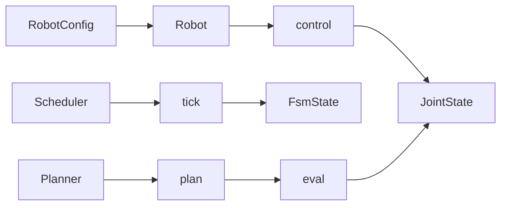

# core

Shared types and abstract interfaces: ABCs and data structures used by robot, scheduler, and planner.

---

## At a glance

| Module | Contents |
|--------|----------|
| **types** | `JointState`, `ObstacleState`, `RobotConfig`, `Pose`, `Twist`, `Wrench`, `RobotState`, `PlannerType`, `SchedulerType`, `RobotType`, `FsmAction`, `FsmState`, `to_*` converters |
| **robot** | `Robot` (ABC): `initialize()`, `control()`, `update()`, FK/IK, etc. |
| **scheduler** | `Scheduler` (ABC): `reset()`, `step()`, `tick(action)` → `(changed, FsmState)`, `_progress_raw(t)` |
| **planner** | `Planner` (ABC): `plan()`, `eval()`, `is_planned()`, `generate_trajectory()` (abstract) |

---

## Abstract classes summary

| Class | Purpose | Required methods to implement |
|-------|---------|-------------------------------|
| **Robot** | Robot model (config, control, update) | `initialize()`, `control()`, `update()` |
| **Scheduler** | Time advance and state from actions | `reset()`, `step()`, `tick(action)` |
| **Planner** | Background path planning | `eval(progress, joint_command)`, `generate_trajectory(...)` |

---

## Data flow (concept)

