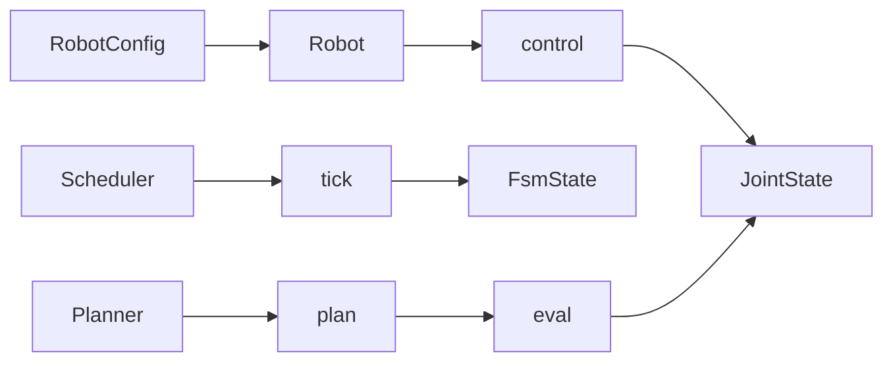

# core

Abstract interfaces **Robot**, **Scheduler**, **Planner** and shared types used by robots, schedulers, and planners.

---

## Overview

- **Purpose:** Define the contracts that concrete robots, schedulers, and planners must implement. Types are in package-level `types.py`; core holds the ABCs.
- **Data flow:** Config → Robot; Robot produces commands via control; Scheduler yields FSM state via tick; Planner produces trajectory and eval gives config at progress.

---

## Abstract class: Robot

- **Module:** `core/robot.py`
- **Role:** Base for all robot models. Subclasses implement initialization, control, update, and mode hooks.
- **Constructor:** `__init__(config: RobotConfig)` — stores config and initializes internal state (joint state, obstacles, progress, mode flags).
- **initialize()** — Abstract. Create scheduler and planner, set collision checker if needed. Called once after construction.
- **control(status: JointState) -> JointState | None** — Abstract. Return next command or None.
- **update(status, obstacles)** — Abstract. Update internal state from feedback and optional obstacles.
- **Mode hooks (abstract, called by control):** `_home()`, `_move()`, `_stop()`, `_auto()` — implement homing, move, stop, auto behavior.

---

## Abstract class: Scheduler

- **Module:** `core/scheduler.py`
- **Role:** Advance time and map actions to FSM state (state id + progress 0–1).
- **Constructor:** `__init__(dt: float)` — sets time step `_dt`, internal time `_t`, duration `_T`.
- **reset()** — Abstract. Set initial state and zero time.
- **step()** — Abstract. Advance internal time by `_dt`.
- **tick(action: FsmAction) -> (bool, FsmState)** — Abstract. Apply action, compute next state and progress; return whether state/progress changed and the new FsmState.
- **_progress_raw(t)** — Progress in [0, 1] for current action duration (helper).

---

## Abstract class: Planner

- **Module:** `core/planner.py`
- **Role:** Run planning in a background thread; expose non-blocking `plan()` and sampling via `eval(progress)`.
- **Constructor:** `__init__()` — starts daemon thread, uses lock and condition variable for plan requests.
- **plan(current_state, target_state, obstacle_state=None)** — Non-blocking. Enqueue plan request; worker runs `_generate_trajectory`. Ignored if already planning.
- **eval(progress: float) -> np.ndarray | None** — Abstract. Return config at progress in [0, 1], or None if no plan.
- **is_planned() -> bool** — True when last plan completed successfully.
- **request_stop()** — Ask worker to stop (e.g. before shutdown).
- **_generate_trajectory(current, target, obstacles) -> bool** — Abstract. Implement in subclass; return True if trajectory was found and stored.
