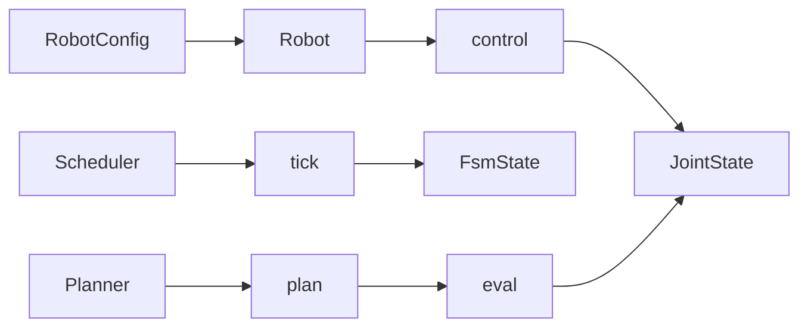

# core

Abstract interfaces: **Robot**, **Scheduler**, **Planner**; shared types.

**Robot (ABC):** `initialize()`, `control()`, `update()`.  
**Scheduler (ABC):** `reset()`, `step()`, `tick(action)` → `(changed, FsmState)`.  
**Planner (ABC):** `plan()`, `eval(progress)`, `is_planned()`, `_generate_trajectory()`.
