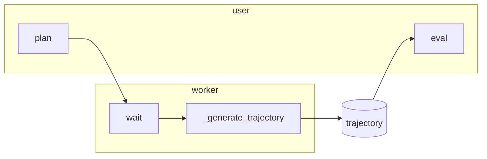
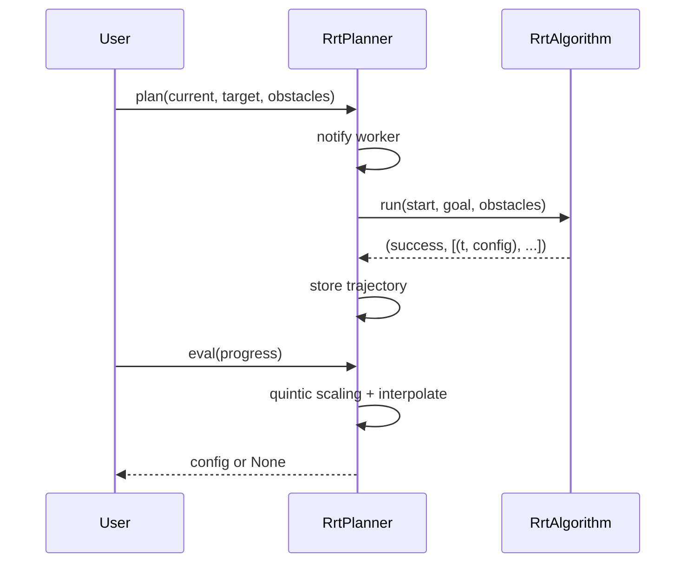

# Planner

Path planning from **current** to **target** in a **background thread**. Config space is generic (`np.ndarray`). Plan is non-blocking; sample the trajectory with `eval(progress)`.

---

## Flow



- **plan(current, target, obstacle_state)** — Request a new plan; worker runs in background. If already running, request is ignored.
- **eval(progress)** — Return config at progress in [0, 1]; quintic time scaling + interpolation. Returns `None` if not planned.
- **is_planned()** — True when the last plan request completed successfully.
- **request_stop()** — Signal worker to exit (e.g. before shutdown).

---

## Planner in the stack

```
        Robot / high-level control
                    │
                    ▼
        ┌───────────────────────────────────────┐
        │  Planner (core ABC)                   │  plan(), eval(), is_planned(), request_stop()
        │  Worker thread + _generate_trajectory │
        └───────────────────────────────────────┘
                    │
                    ▼
        ┌───────────────────────────────────────┐
        │  RrtPlanner                           │  RrtAlgorithm, set_bounds(), set_collision_checker()
        │  Trajectory: [(t, config), ...]       │  eval(progress) → np.ndarray | None
        └───────────────────────────────────────┘
```

- **core.planner:** Abstract `Planner` — threading, `plan`/`eval`/`is_planned`/`request_stop`; subclasses implement `_generate_trajectory`.
- **planner:** `RrtPlanner` — uses `RrtAlgorithm`, stores trajectory; `set_bounds(min, max)` for sampling; optional `set_collision_checker(collision_fn, segment_fn)` for `SphereObstacleState` / `CircleObstacleState`.

---

## Data flow (RrtPlanner)



- **Inputs:** `current_state`, `target_state` as `np.ndarray`; optional list of `SphereObstacleState` | `CircleObstacleState`.
- **Output:** Trajectory as list of `(t, config)`; `eval(progress)` returns a single config at that progress.
