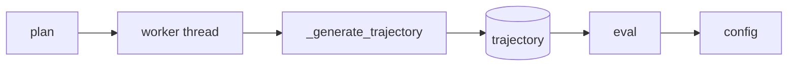

# Planner

Plan path **current → target** in a **background thread**; sample with `eval(progress)`.

**RrtPlanner:** `plan(current, target, obstacles)` → worker runs RRT; `eval(progress)` → config or None (quintic + interpolate). Set `set_bounds()`, `set_collision_checker()` before planning.
