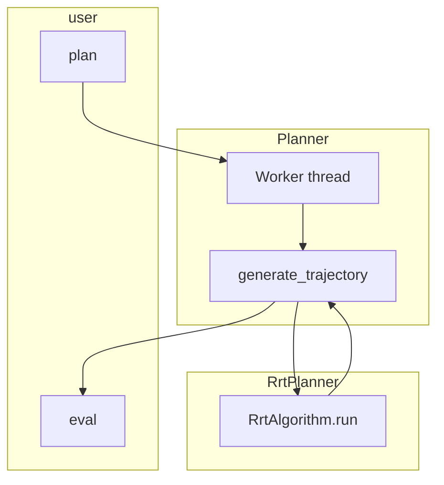

# Planner

Path planning: build a trajectory from current to target in a **background thread**, then sample it with `eval(progress, joint_command)`. Supports joint space and **arbitrary config spaces** (pose, velocity, etc.).

---

## At a glance



| Module | Contents |
|--------|----------|
| **core.planner** | `Planner` (ABC), `JointState`, `ObstacleState` |
| **planner** | `RrtPlanner` (Planner + RrtAlgorithm) |
| **utils.rrt** | `RrtAlgorithm`, `quintic_time_scaling`, `interpolate`, `steer`, `joint_distance`, etc. |

---

## API summary

### Planner (core) – abstract

| Method | Role |
|--------|------|
| `plan(current, target, obstacle_state)` | Request trajectory asynchronously; worker calls `generate_trajectory()`. |
| `eval(progress, joint_command)` | Sample planned trajectory at progress and fill `joint_command`. |
| `is_planned()` | Whether the last request succeeded and a trajectory is ready. |
| `request_stop()` | Ask worker to exit (call on shutdown). |
| `generate_trajectory(...)` | *(abstract)* Compute the trajectory. |

### RrtPlanner (this package)

| Method / setting | Description |
|------------------|-------------|
| `RrtPlanner(dt=0.01, seed=None)` | Constructor. |
| `set_joint_limits(min_pos, max_pos)` | Joint sampling bounds. |
| `set_collision_checker(config_fn, segment_fn)` | Joint-space collision: `config_fn(q, obstacle)`, `segment_fn(a, b, obstacle)`. |
| `set_collision_checker_config(config_fn, segment_fn)` | Generic config-space collision: `config_fn(config, obstacle)`, `segment_fn(cfg_a, cfg_b, obstacle)`. |
| `set_bounds(min_config, max_config)` | Config-space sampling bounds (np.ndarray). |
| `generate_trajectory(current, target, obstacle)` | Run RrtAlgorithm and store trajectory; returns success. |
| `eval(progress, joint_command)` | Quintic scaling + interpolation to fill `joint_command`. |
| `eval_config(progress)` | For generic config space: return config vector at progress. |

### RrtAlgorithm (utils.rrt)

| Item | Description |
|------|-------------|
| Constructor | `step_size`, `goal_bias`, `goal_threshold`, `max_iterations`, `interp_steps`, `seed` |
| `run(start, goal, obstacle_state)` | Blocking RRT. Returns: `(success, list[(t, state)])`. |

---

## Minimal example

```python
from robot_manager.planner import RrtPlanner
from robot_manager.core import JointState
import numpy as np

planner = RrtPlanner(seed=42)
planner.set_joint_limits(np.array([-np.pi, -np.pi]), np.array([np.pi, np.pi]))
start = JointState(id=np.arange(2), position=np.zeros(2), velocity=np.zeros(2), torque=np.zeros(2))
goal  = JointState(id=np.arange(2), position=np.array([0.5, 0.5]), velocity=np.zeros(2), torque=np.zeros(2))

planner.plan(start, goal, None)
while not planner.is_planned():
    time.sleep(0.05)
cmd = JointState(id=start.id.copy(), position=np.zeros(2), velocity=np.zeros(2), torque=np.zeros(2))
planner.eval(0.5, cmd)  # cmd.position holds joint angles at 50% along the path
```

---

## Glossary

- **Configuration space:** Any Euclidean space (joint angles, end-effector pose, velocity, etc.).
- **Trajectory:** Sequence of (progress, state/config); 0 = start, 1 = goal.
- **eval(progress):** Sample the trajectory at that progress and return command/config.
