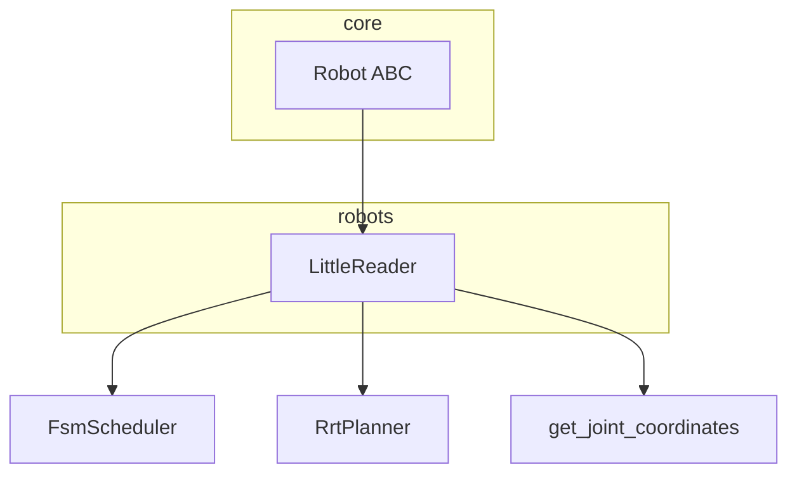
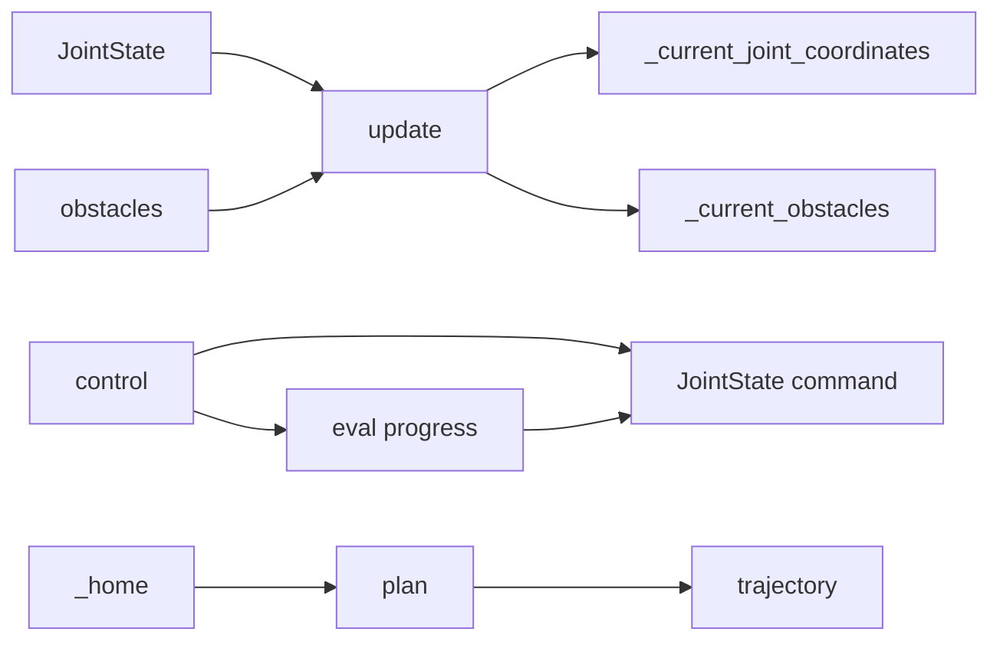

# robots

Concrete robot implementations; each subclasses **core.Robot** and implements `initialize`, `control`, `update`, and mode hooks (`_home`, `_move`, `_stop`, `_auto`).

---

## Structure

- **LittleReader** — Dual-arm style model: FSM scheduler, RRT planner, DH-based forward kinematics. Plans in configuration space; collision uses **SelfObstacleState** (links) and **CircleObstacleState** (environment).

---

## Data flow (LittleReader)

- **update(status, obstacles)** — Updates joint state, then `_update_current_joint_coordinates_and_obstacles` (FK + self-obstacle positions). Optionally merges external obstacles by id.
- **control(status)** — Mode dispatch (homing / move / stop / auto). If a plan exists, returns command from `planner.eval(progress)` and steps the scheduler.
- **_home** — Ticks FSM; when progress &gt; 0, sets planner bounds and calls **plan(current_config, home_config, obstacles)**. Resets planner when progress reaches 1.0.

---

## Kinematics and visualization

- **get_joint_coordinates(joint_positions)** — Returns **(8, 3)** Cartesian positions from DH forward kinematics. Index **4** is the **end effector** position (used for path drawing in 3D).
- **_current_joint_coordinates** — Same 8×3 layout; updated in `update` from current joint state.
- **Obstacles** — **SelfObstacleState** (link spheres, neighbor exclusions) and **CircleObstacleState** (axis-aligned disk). Both used by the planner’s collision checker.
