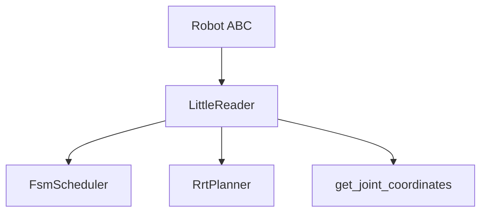
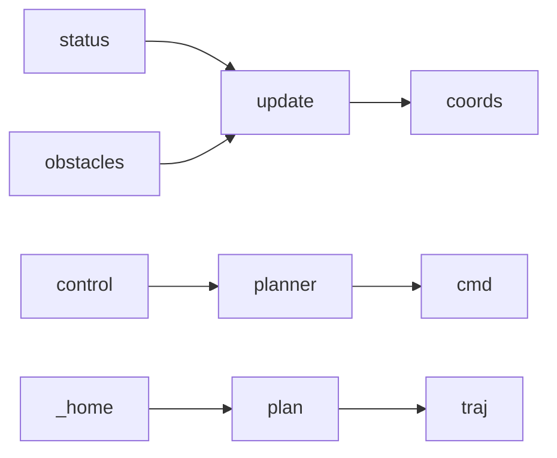
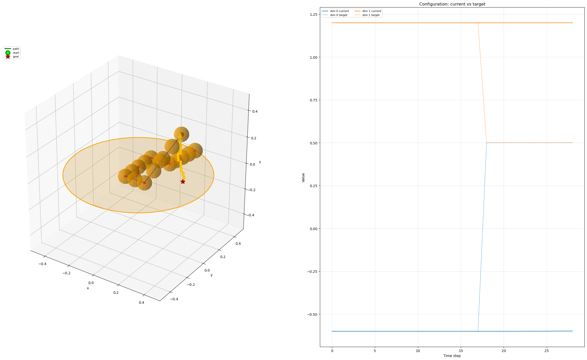

# robots

Concrete robots: subclass **core.Robot**; implement `initialize`, `control`, `update`, and `_home` / `_move` / `_stop` / `_auto`.

**LittleReader:** Dual-arm; FSM + RRT; DH FK. Collision: **SelfObstacleState** (links), **CircleObstacleState**.  
**Key:** `update` → FK + obstacles; `control` → mode dispatch, `planner.eval(progress)` → command; `_home` → plan to home config.

