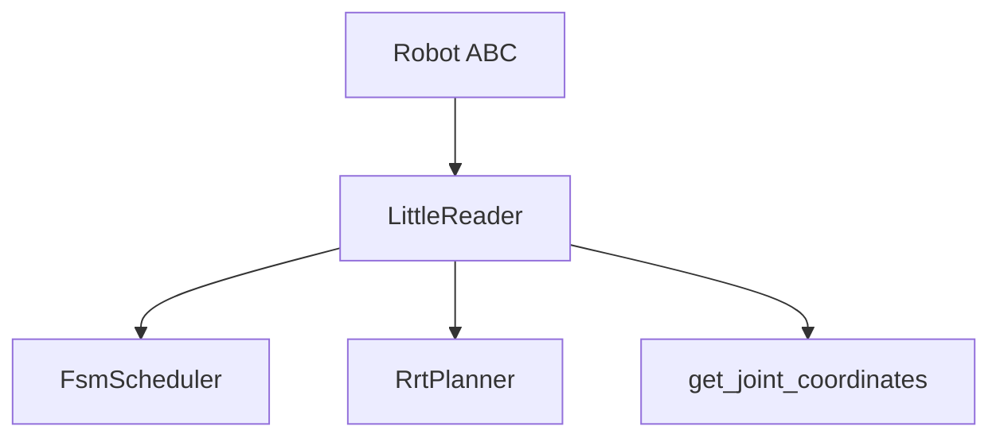
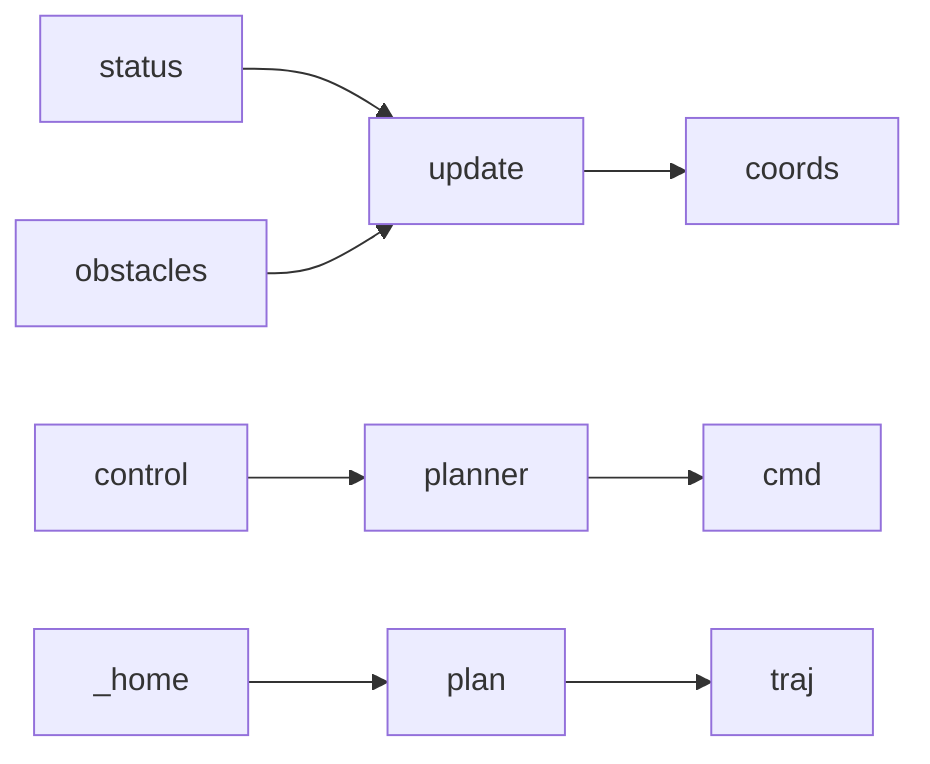

# robots

Concrete robot implementations. Each subclasses **core.Robot** and implements `initialize`, `control`, `update`, and mode hooks (`_home`, `_move`, `_stop`, `_auto`).

---

## Overview

- **Purpose:** Provide a concrete robot (LittleReader) that uses an FSM scheduler, RRT planner, and DH-based forward kinematics. Plans in configuration space with circle and self-collision checking.
- **Data flow:** `update(status, obstacles)` updates joint state and FK/obstacles; `control(status)` dispatches by mode and, when a plan exists, returns command from `planner.eval(progress)`; `_home` ticks the scheduler and calls `plan(current_config, home_config, obstacles)` when appropriate.

---

## Class: LittleReader

- **Module:** `robots/little_reader.py`
- **Inherits:** `core.Robot`
- **Role:** Dual-arm style model: FSM scheduler, RRT planner, DH forward kinematics. Collision uses **SelfObstacleState** (link spheres, neighbor exclusions) and **CircleObstacleState** (e.g. table/plane).

**Initialization and config**

- **__init__(config: RobotConfig)** — Sets link lengths, joint state, `_current_obstacles` (self + circle), configuration bounds, home config, control indexes, meaningful joint indexes for visualization.
- **initialize()** — Creates `FsmScheduler(0.05)` and `RrtPlanner()`, updates FK/obstacles once, sets planner collision checker to `_collision_checker` and `_segment_collision_checker`.

**Public methods**

- **control(status) -> JointState | None** — If homing/moving/auto/stop, calls `_home`/`_move`/`_auto`/`_stop`. If planned, returns command from `planner.eval(_current_progress)` and steps scheduler; else returns current joint state.
- **update(status, obstacles)** — Updates `_current_joint_state.position`, runs `_update_current_joint_coordinates_and_obstacles` (FK + self-obstacle positions), updates `_current_configuration`. Merges external obstacles by id (no replace for existing ids).
- **inverse_kinematics(position) -> np.ndarray** — Maps (6,) task-space positions (left/right) to joint positions.
- **get_circle_obstacles(joint_positions)** — Returns list of `CircleObstacleState` from `_current_obstacles`.
- **get_self_obstacles(joint_positions)** — FK at given joints; returns list of `SelfObstacleState` for links (with neighbor exclusions).
- **get_joint_coordinates(joint_positions) -> np.ndarray** — Returns (8, 3) Cartesian positions from DH FK. Index 4 is end-effector (used for 3D path drawing).

**Mode hooks (internal)**

- **_home()** — Ticks scheduler with HOME action; when progress > 0 sets planner bounds and calls `plan(current_config, home_config, _current_obstacles)`; when progress 1.0 resets planner and advances home phase. After two phases, clears homing flag.
- **_move()** — Placeholder.
- **_stop()** — Sends STOP, resets planner and scheduler, clears progress.
- **_auto()** — Placeholder.

**Collision (internal)**

- **_collision_checker(config, obstacle_state)** — Splits obstacles into circle/self; returns True if config collides with any.
- **_segment_collision_checker(config_a, config_b, obstacle_state)** — Same split; True if segment intersects any obstacle.

---

## Kinematics and visualization

- **get_joint_coordinates** — (8, 3) layout; index 4 = end effector for left arm in first home phase, index 7 for right in second phase. Used by GUI for path and links.
- **_current_joint_coordinates** — Same layout; updated in `update` from current joint state.
- **Obstacles** — SelfObstacleState (link spheres, neighbor_id excludes adjacent links); CircleObstacleState (axis-aligned disk). Both used by planner collision checker.
