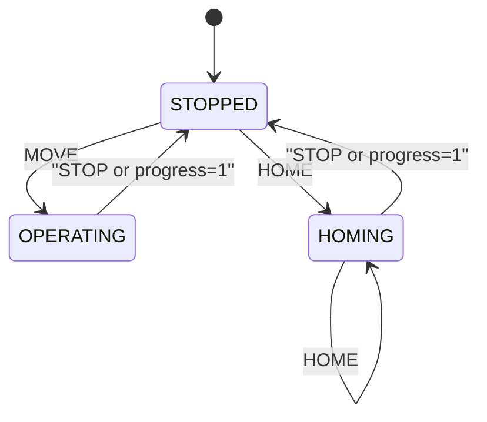

# Scheduler

Decides **when** to do **what**: advances time (`step`), applies actions (`tick`), and exposes **state** (STOPPED, OPERATING, HOMING) and **progress** (0–1).

---

## Overview

- **Purpose:** Drive FSM state and progress from actions (STOP, MOVE, HOME). When progress reaches 1.0, state goes back to STOPPED. Invalid transitions raise.
- **Stack:** `core.Scheduler` (ABC) → `FsmScheduler` (concrete, uses transition table).

---

## Classes and enums: FsmScheduler

- **Module:** `scheduler/fsm_scheduler.py`
- **Inherits:** `core.Scheduler`
- **State (enum):** `STOPPED`, `OPERATING`, `HOMING`, `INVALID` (result of invalid transition).
- **Action (enum):** `STOP`, `MOVE`, `HOME`.
- **TRANSITION_TABLE:** `(State, Action) -> State`. e.g. (STOPPED, MOVE) → OPERATING; (OPERATING, HOME) → INVALID.
- **get_next_state(current, action)** — Returns next state from table; `INVALID` if no entry.

---

## Class: FsmScheduler

- **Constructor:** `__init__(dt: float)` — sets time step; initial state is STOPPED.
- **reset()** — State = STOPPED, internal time = 0.
- **step()** — Advance internal time by `_dt`.
- **tick(action: FsmAction) -> (bool, FsmState)** — Compute next state from transition table and current progress. If next state is INVALID, raises `ValueError`. Returns `(changed, FsmState)`; `changed` True if state transitioned or progress reached 1.0. When progress is 1.0, state is reset to STOPPED.

---

## Types

- **FsmAction** — `action` (int/enum), `duration` (float). From `types`.
- **FsmState** — `state` (int), `progress` (float). From `types`.
