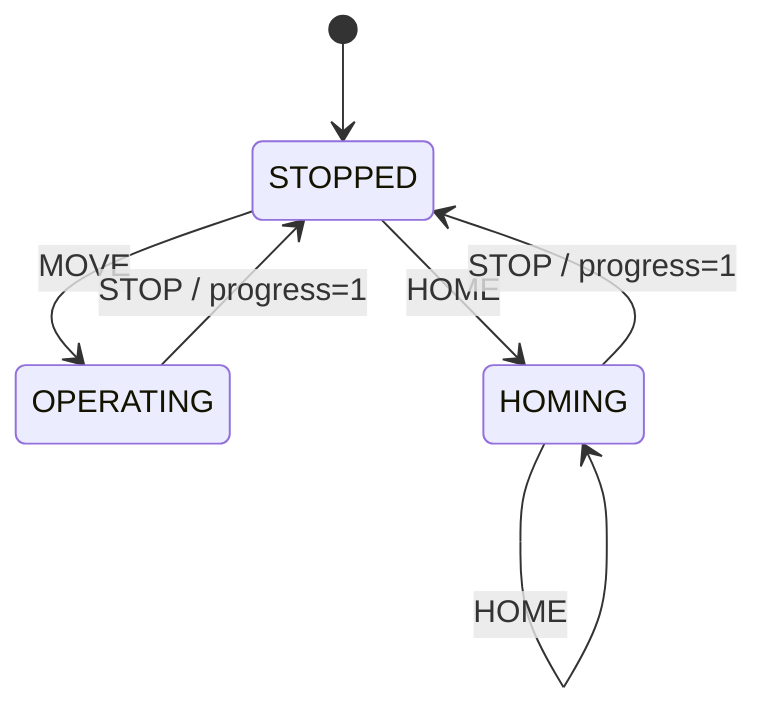

# Scheduler

**When / what:** advance time (`step`), apply actions (`tick`), expose state and progress (0–1).

**FsmScheduler:** `reset()` → STOPPED, time 0; `step()` → advance dt; `tick(FsmAction)` → `(changed, FsmState)`. Invalid transition raises.
