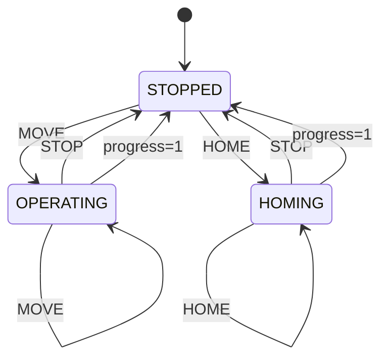
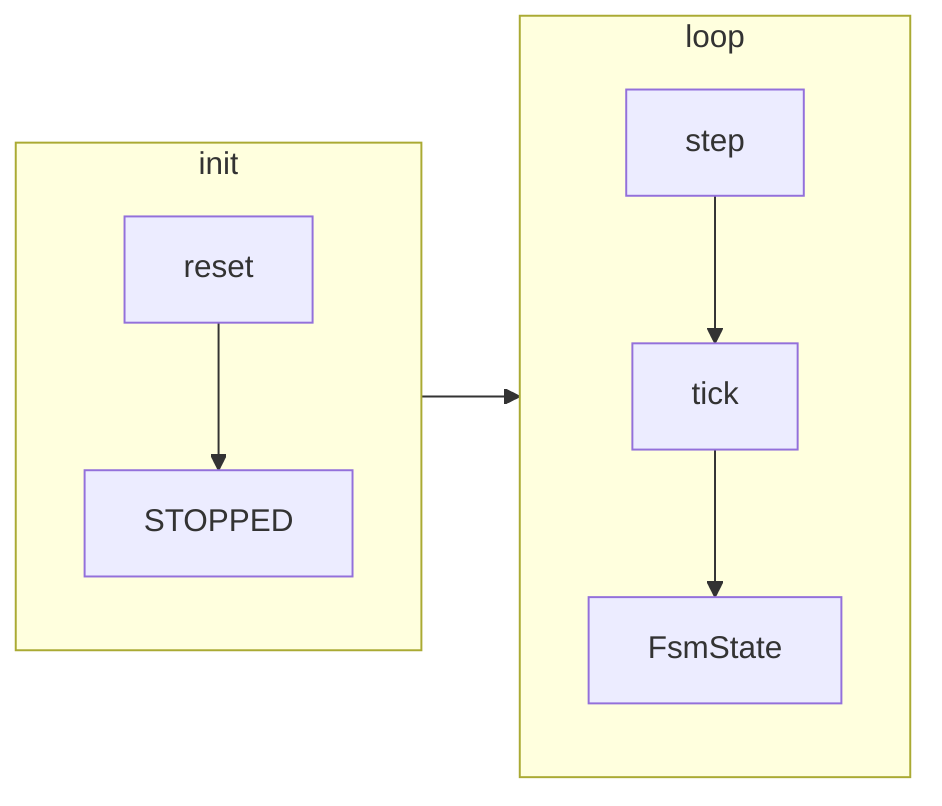

# Scheduler

Decides **when** to do **what**: advances time (`step`), applies actions (`tick`), and exposes **state** (STOPPED, OPERATING, HOMING) and **progress** (0–1).

---

## FSM states and transitions



- **States:** STOPPED, OPERATING, HOMING, INVALID (invalid transition).
- **Actions:** STOP, MOVE, HOME. Invalid (current, action) → `tick()` raises `ValueError`.
- **OPERATING** or **HOMING** with progress 1.0 → transition to STOPPED.

---

## Flow



- **reset()** → state = STOPPED, time = 0.
- **step()** → advance time by `dt`.
- **tick(action)** → apply transition, compute progress; returns `(changed, FsmState)`.

---

## Scheduler in the stack

```
        Robot / RobotManager
                    │
                    ▼
        ┌───────────────────────┐
        │  Scheduler (core ABC) │  reset, step, tick(action) → (changed, FsmState)
        └───────────────────────┘
                    │
                    ▼
        ┌───────────────────────┐
        │  FsmScheduler         │  State, Action, transition table
        └───────────────────────┘
```

- **core.scheduler:** abstract `Scheduler` — `reset()`, `step()`, `tick(FsmAction)`.
- **scheduler:** `FsmScheduler` implements it; uses `State`, `Action`, `FsmState`, `FsmAction`.
