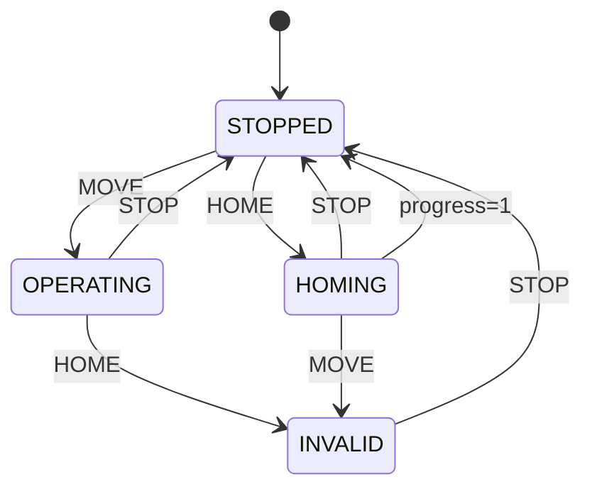

# Scheduler

Decides **when** to do **what**: advances time (`step`), applies actions (`tick`), and exposes internal **state** (STOPPED, OPERATING, HOMING, etc.) and **progress** (0–1).

---

## At a glance



| Module | Contents |
|--------|----------|
| **core.scheduler** | `Scheduler` (ABC): `reset()`, `step()`, `tick(action)` |
| **scheduler.fsm_scheduler** | `State`, `Action`, `FsmState`, `FsmAction`, `TRANSITION_TABLE`, `get_next_state`, `FsmScheduler` |

---

## Transition table (FSM)

| Current \\ Action | STOP | MOVE | HOME |
|-------------------|------|------|------|
| **STOPPED** | STOPPED | OPERATING | HOMING |
| **OPERATING** | STOPPED | OPERATING | INVALID |
| **HOMING** | STOPPED | INVALID | HOMING |
| **INVALID** | STOPPED | INVALID | INVALID |

- **Special rule:** When in HOMING and **progress == 1.0**, state transitions to **STOPPED**.
- Invalid (current, action) pairs → INVALID; `tick()` raises `ValueError`.

---

## API summary

### Scheduler (core) – abstract

| Method | Role |
|--------|------|
| `reset()` | Reset to initial state and time. |
| `step()` | Advance internal time `_t += _dt`. |
| `tick(action)` | Apply action and return (state changed?, FsmState). |
| `_progress_raw(t)` | Current action progress `t / _T` (internal). |

### FsmScheduler (this package)

| Item | Description |
|------|-------------|
| **State** | STOPPED, OPERATING, HOMING, INVALID |
| **Action** | STOP, MOVE, HOME |
| **FsmState** | `state`, `progress` (0–1) |
| **FsmAction** | `action`, `duration` (seconds) |
| `FsmScheduler(dt)` | Constructor with time step `dt`. |
| `tick(FsmAction)` | Apply transition table, update progress. Returns: `(changed: bool, FsmState)`. |

---

## Data flow

```
reset()     → _state = STOPPED, _t = 0
step()      → _t += _dt
tick(action)→ _T = duration, progress = _progress_raw(_t+_dt)
              next_state = get_next_state(_state, action)
              if progress==1.0 then (e.g. HOMING→STOPPED) then return (True, FsmState)
```

---

## Minimal example

```python
from robot_manager.scheduler.fsm_scheduler import FsmScheduler, FsmAction, Action, State

scheduler = FsmScheduler(dt=0.1)
changed, fsm = scheduler.tick(FsmAction(Action.MOVE, duration=1.0))  # OPERATING
scheduler.step()
changed, fsm = scheduler.tick(FsmAction(Action.MOVE, duration=1.0))  # progress increases
changed, fsm = scheduler.tick(FsmAction(Action.STOP, duration=0.0))  # STOPPED
```

**Wait until homing completes:**

```python
scheduler.reset()
scheduler.tick(FsmAction(Action.HOME, duration=1.0))
while scheduler._state != State.STOPPED:
    scheduler.step()
    scheduler.tick(FsmAction(Action.HOME, duration=1.0))
```
