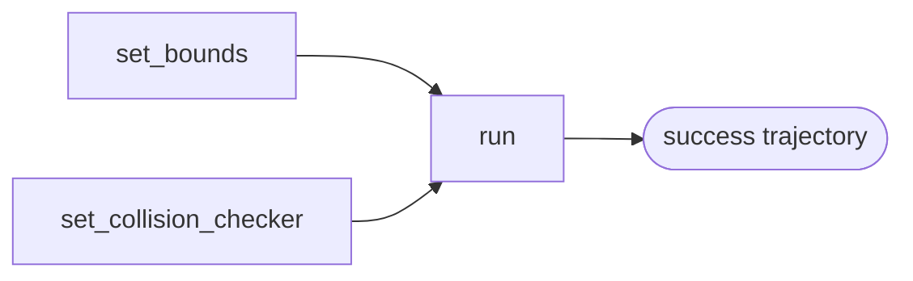

# utils

**RRT algorithm** (no threading) and **geometry / path / kinematics** helpers used by the planner and robot models.



```mermaid
flowchart LR
  distance --> RrtAlgorithm
  steer --> RrtAlgorithm
  interpolate --> RrtAlgorithm
  quintic_time_scaling --> RrtPlanner
  interpolate --> RrtPlanner
```

---

## Overview

- **Purpose:** Provide RRT in arbitrary Euclidean config space (np.ndarray) and shared helpers for distance, steer, interpolation, time scaling, and DH kinematics. Used by `RrtPlanner` and by robots (e.g. LittleReader) for FK and collision.
- **Modules:** `rrt.py` (RrtAlgorithm), `utils.py` (geometry/time scaling), `kinematics.py` (DH transformation and FK).

---

## Class: RrtAlgorithm (rrt.py)

- **Role:** Pure RRT logic: sample, nearest, steer, collision check, grow tree until goal is reached or max iterations. No threading; called from planner worker.
- **Constructor:** `__init__(*, step_size, goal_bias, goal_threshold, max_iterations, interp_steps, seed=None)` — stores parameters. Bounds and collision checkers set separately.
- **set_bounds(min_bounds, max_bounds)** — Sampling bounds per dimension (np.ndarray). Required for sampling.
- **set_joint_limits(min_positions, max_positions)** — Convenience alias for set_bounds.
- **set_collision_checker(collision_fn, segment_fn)** — Optional. `collision_fn(config, obstacle_list) -> bool`; `segment_fn(config_a, config_b, obstacle_list) -> bool`.
- **run(start, goal, obstacle_state=None) -> (bool, list[(t, config)])** — Blocking RRT. Returns success and trajectory with progress in [0, 1]. Empty list on failure. Uses goal bias, step size, goal threshold, max iterations.

---

## Functions: utils.py

- **quintic_time_scaling(t: float) -> float** — Smooth progress in [0, 1], zero velocity at start/end. Input clamped to [0, 1]. Used by RrtPlanner for eval.
- **distance(a, b: np.ndarray) -> float** — Euclidean distance (flattened).
- **steer(from_vec, toward_vec, step_size) -> np.ndarray** — Step from `from_vec` toward `toward_vec` by at most `step_size`. Used by RrtAlgorithm.
- **interpolate(a, b, t) -> np.ndarray** — Linear interpolation; t clamped to [0, 1]. Used by RrtAlgorithm and RrtPlanner.

---

## Functions: kinematics.py

- **transformation_matrix(a, alpha, d, theta) -> np.ndarray** — 4×4 DH homogeneous matrix for one link.
- **forward_kinematics(dh_parameters: np.ndarray) -> np.ndarray** — (n, 4) DH params → (n, 3) xyz positions of link origins. Used by LittleReader for FK and obstacle positions.
