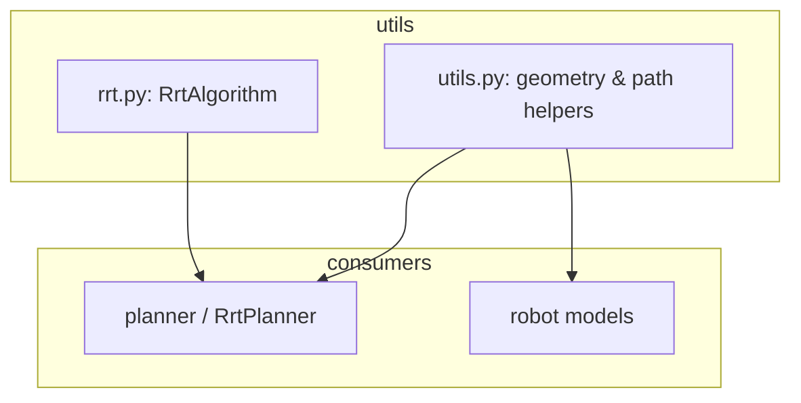
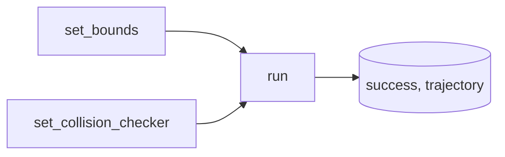

# utils

RRT algorithm and geometry/planning helpers. Used by the **planner** (RrtPlanner) and optionally by robot models (e.g. transformation matrix).

---

## Package layout



- **rrt.py** — `RrtAlgorithm`: sampling, steer, collision check; `run(start, goal, obstacles)` → `(success, [(t, config), ...])`. No threading.
- **utils.py** — `transformation_matrix`, `quintic_time_scaling`, `distance`, `steer`, `interpolate`.

---

## RrtAlgorithm (rrt.py)



- **set_bounds(min, max)** — Sampling bounds (any dimension, `np.ndarray`).
- **set_joint_limits(min, max)** — Same as `set_bounds` (convenience for joint space).
- **set_collision_checker(collision_fn, segment_fn)** — Optional: point and segment collision with `SphereObstacleState` / `CircleObstacleState`.
- **run(start, goal, obstacle_state)** — Blocking RRT; returns `(success, list of (t, config))`. Uses goal bias, step size, goal threshold, max iterations.

Config space is generic `np.ndarray` (joint angles, pose, or any Euclidean space).

---

## Geometry and path helpers (utils.py)

```mermaid
flowchart LR
  pose_in[Pose] --> transformation_matrix
  t_in[t] --> quintic_time_scaling
  ab[a, b] --> distance
  vecs[from_vec, toward_vec] --> steer
  abt[a, b, t] --> interpolate
```

- **transformation_matrix(pose)** — 4×4 homogeneous matrix from `Pose` (position + RPY in radians); rotation order Rz·Ry·Rx then translation.
- **quintic_time_scaling(t)** — Smooth progress in [0, 1] with zero velocity at start and end; input clamped to [0, 1].
- **distance(a, b)** — Euclidean distance between two vectors (flattened).
- **steer(from_vec, toward_vec, step_size)** — Step from `from_vec` toward `toward_vec` by at most `step_size`.
- **interpolate(a, b, t)** — Linear interpolation between `a` and `b` at `t` in [0, 1].

RrtAlgorithm uses `distance`, `steer`, and `interpolate` internally; RrtPlanner uses `quintic_time_scaling` and `interpolate` for `eval(progress)`.
