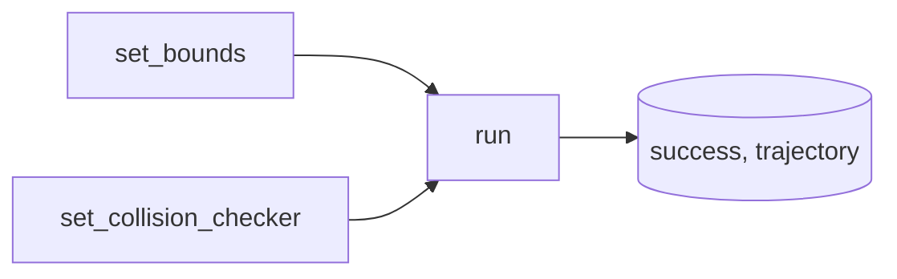

# utils

**RRT algorithm** and **geometry/path** helpers for planner and robots.



```mermaid
flowchart LR
  distance --> RrtAlgorithm
  steer --> RrtAlgorithm
  interpolate --> RrtAlgorithm
  quintic_time_scaling --> RrtPlanner
  interpolate --> RrtPlanner
```

**rrt.py:** `RrtAlgorithm.run(start, goal, obstacles)` → `(success, [(t, config), ...])`. Optional bounds and collision checker.  
**utils.py:** `distance`, `steer`, `interpolate`, `quintic_time_scaling`; **kinematics:** DH `transformation_matrix`, `forward_kinematics`.
