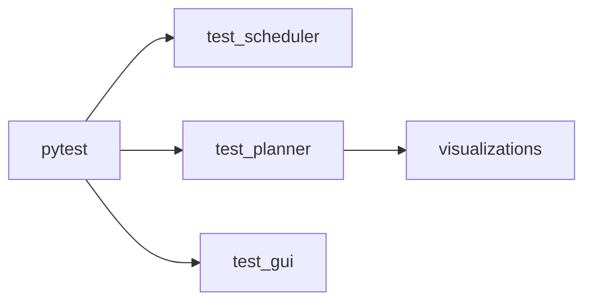

# Tests

Run the full suite from project root:

```bash
python3 -m pytest tests/ -v
```



---

## Overview

- **Purpose:** Validate config loading, RobotManager initialization, FSM scheduler transitions and tick/reset behavior, RRT algorithm and RrtPlanner plan/eval, and optional visualization output. Same entrypoint can run GUI (test_gui.py).
- **Layout:** Three test modules; planner tests can write PNGs under `tests/visualizations/` (created automatically if needed).

---

## Test modules

**test_scheduler.py**

- **Scope:** FSM scheduler: transition table and FsmScheduler.
- **TestGetNextState:** Covers all (State, Action) pairs: STOPPED→OPERATING/HOMING, OPERATING→STOPPED/OPERATING/INVALID(HOME), HOMING→STOPPED/HOMING/INVALID(MOVE).
- **TestFsmScheduler:** Initial state STOPPED; step() increments time; tick(MOVE) STOPPED→OPERATING; tick(STOP) OPERATING→STOPPED; tick(HOME) from OPERATING raises; reset() sets STOPPED and time 0; tick(HOME) until progress 1.0 then state STOPPED.

**test_planner.py**

- **Scope:** RrtAlgorithm (no threading) and RrtPlanner (plan, eval, trajectory).
- **TestRrtAlgorithm:** Same start/goal returns success; size mismatch returns failure; trajectory shape.
- **TestRrtPlanner:** plan() triggers run and stores trajectory; eval with/without plan (None after plan, config at progress after plan).
- **TestVisualizeConfigSpaces:** Optional visualization tests (joint space, pose position, velocity linear). Write PNGs to `tests/visualizations/` (e.g. `config_space_joint.png`). Require matplotlib.

**test_gui.py**

- **Scope:** Config existence, RobotManager initialization; same file runs the Robot Manager GUI.
- **TestGui:** Config file exists; RobotManager(config_path) initializes and `_robot` is not None.
- **GUI:** Run with `python tests/test_gui.py` (no args). Uses `config/robot_config.yaml`. Buttons: Home, Move, Stop, Auto. control/update run on timers.

---

## Running

- **All tests:** `python3 -m pytest tests/ -v`
- **One file:** `python3 -m pytest tests/test_scheduler.py -v`
- **GUI only:** `python tests/test_gui.py`
- **Tests from test_gui:** `python tests/test_gui.py --test` or run pytest on test_gui.
