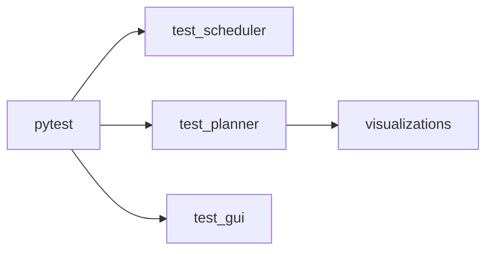

# Tests



```bash
python3 -m pytest tests/ -v
```

**test_scheduler.py** — FSM states, transitions, tick, reset.  
**test_planner.py** — RrtAlgorithm, RrtPlanner, plan/eval; writes `tests/visualizations/*.png`.  
**test_gui.py** — Config + RobotManager init; same file runs GUI: `python tests/test_gui.py`.
